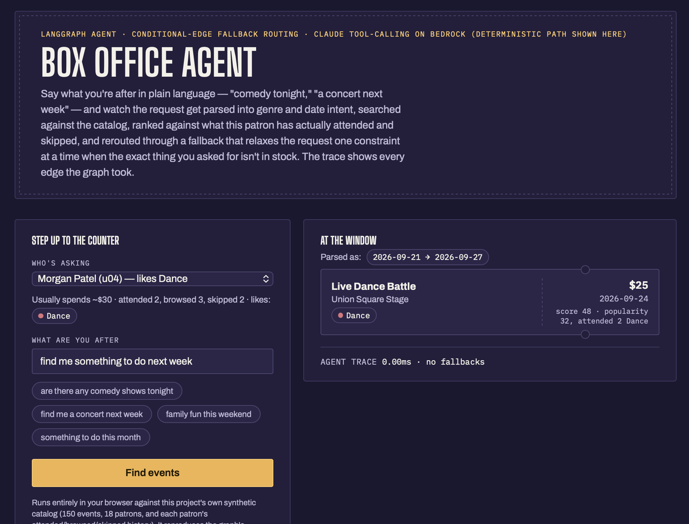

# Event Recommendation Agent

> **What this is.** I started this alongside my employer's AI training sandbox while
> studying for the AWS AI certification, then kept extending it on my own to learn
> agentic AI fundamentals hands-on: tool calling, guardrails, fallback design, and
> LangGraph. It's a learning project, not a production system, and the scope reflects
> that.

A LangGraph agent that turns a request like *"find me a concert next week"*
into ranked event recommendations, using the user's genre preferences,
budget, and attendance history.

- **Claude on Amazon Bedrock drives the tools** when credentials are present: it decides whether to look up the user, what to search for, and when it's done. Arguments are schema-validated, tool errors go back to the model, and the loop is bounded.
- **A deterministic path runs without AWS**: keyword parsing and a fixed tool sequence. No cloud call, no key needed.
- **Fallbacks are LangGraph conditional edges**, one node per fallback, and a test asserts the exact edge set.
- **An empty search relaxes one constraint at a time** (dates, then budget, then genre) instead of throwing the request away.
- **Ranking is personalised**: genres the user attended are boosted, genres they skipped are penalised, and every recommendation carries a one-line reason.
- Every tool call and model round-trip is timed and logged. All data is synthetic (`data/*.json`).

## [Try it in your browser](https://claude.ai/code/artifact/c59cd02b-9945-405e-9bd7-c8e2a4c8158e)



Pick a patron, type a request, and expand the trace to see each edge the
graph took. It's a JavaScript port of the deterministic path against the
same dataset, not the Python backend itself.

Built with Claude Code as an AI coding assistant.

## Quick start

```bash
python3 -m venv .venv && source .venv/bin/activate
pip install -r requirements.txt

pytest                                             # 58 tests, no AWS needed
python3 demo.py u01 "find me a concert next week"  # one query (-v for per-node logs)
python3 demo.py                                    # interactive mode
```

```
$ python3 demo.py u01 "find me a concert next week"

Parsed intent: {'genres': ['Music'], 'date_from': '2026-09-21', 'date_to': '2026-09-27'}
Fallbacks used: ['alternative_source_fallback']
  alternative_source_fallback: drop_dates

Recommendations:
  - Indie Music Live (Music) at Skyline Rooftop on 2027-01-16 — $15  [popularity 74, browsed 1 Music, skipped 1 Music]
  - Local Music Tour Stop (Music) at Downtown Pavilion on 2026-12-12 — $0  [popularity 72, browsed 1 Music, skipped 1 Music]
  ...
```

Nothing matched that exact week, so the agent kept the genre and dropped the
dates rather than returning trending events of any kind.

### Using Bedrock

The repo ships **no AWS credentials**, on purpose. To run the LLM path,
bring your own: enable Bedrock and a Claude model in your account, then
configure a profile (`aws configure --profile <name>`) or export access keys.

```bash
export AWS_PROFILE=<name>
export AWS_REGION=us-east-1
export BEDROCK_MODEL_ID=anthropic.claude-opus-5   # any Claude model enabled in your account
python3 demo.py --transcript u01 "comedy tonight" # prints the full exchange with the model
```

Set `EVENT_AGENT_LLM=off` to force the deterministic path even with
credentials. Never commit credentials; tests and the deterministic path
need none.

**A note on the LLM path.** I originally ran this path against live Bedrock
from a practice sandbox I no longer have access to, and a new AWS account
needs Anthropic's Bedrock model-access approval before it can call Claude.
Until that clears, the tool-calling loop is exercised in
`tests/test_tool_calling.py` against a scripted fake client shaped like a
real Bedrock response: argument validation, parallel tool calls, tool errors,
unknown tools, and the iteration cap. A real transcript will follow once
access is approved.

## How it works

```
                            ┌─────────┐
                            │  start  │  Bedrock available? → execution_path
                            └────┬────┘
                   ┌─────────────┴──────────────┐
                   ▼                            ▼
         ┌──────────────────┐  failed   ┌──────────────────┐
         │  llm_tool_loop   │──────────►│   parse_query    │  rule-based genre + date
         │  Claude picks &  │           └────────┬─────────┘
         │  calls the tools │                    ▼
         └──┬───────────┬───┘           ┌──────────────────┐
         ok │     empty │               │ fetch_preferences│
            │           │               └───┬──────────┬───┘
            │           │            failed │          │ ok
            │           │                   ▼          │
            │           │  ┌────────────────────────┐  │
            │           │  │ graceful_degradation_  │  │  Fallback A: default profile
            │           │  │ fallback               │  │
            │           │  └───────────┬────────────┘  │
            │           │              ▼               ▼
            │           │            ┌────────────────────┐
            │           │            │   search_events    │
            │           │            └───┬────────────┬───┘
            │           │  empty/failed  │            │ ok
            │           ▼                ▼            │
            │  ┌────────────────────────────┐         │
            │  │ alternative_source_fallback│         │  Fallback B: drop dates → drop budget → trending
            │  └─────────────┬──────────────┘         │
            │                ▼                        ▼
            │          ┌────────────────────────────────┐
            └─────────►│  rank_events                   │  popularity + attendance history
                       └───────┬─────────────────────┬──┘
                        failed │                     │ ok
                               ▼                     │
                  ┌─────────────────────────┐        │
                  │ partial_results_fallback│        │  Fallback C: top 10 unranked
                  └────────────┬────────────┘        │
                               ▼                     ▼
                             ┌────────────────────────┐
                             │     format_output      │ ──► END
                             └────────────────────────┘
```

Each labelled arrow is a LangGraph conditional edge. A failing node records
its error in the state, and the edge routes to the matching fallback node.

**LLM path.** Claude gets two tools, `fetch_user_preferences` (no arguments,
so it can only see the current user) and `search_events`, and decides what to
call. Three guardrails:

1. **Inputs are validated** against a schema before any tool runs.
2. **Errors go back to the model** as error results, so it can adjust instead of crashing.
3. **The loop is capped.** If it stalls or finishes without a search, the graph reruns the request on the deterministic path.

Claude only plans and searches. Ranking and fallbacks are plain code shared by both paths.

**Ranking.** Popularity score, adjusted by the user's history in the same
genre: +8 per attended event, +3 per browsed, −5 per skipped. Already-attended
events are dropped. Each result carries its score and a reason, such as
`popularity 64, attended 3 Sports`.

## Tests

```bash
pytest -v
```

| File | Covers |
|---|---|
| `test_agent.py` | exact conditional-edge set, every fallback route, LLM path success / empty / failover / skipped |
| `test_tool_calling.py` | the LLM loop against a scripted fake client: bad arguments, tool exceptions, parallel calls, unknown tools, iteration cap, API failure |
| `test_fallbacks.py` | each fallback, including every relaxation stage of Fallback B |
| `test_tools.py` | search filters and the personalised ranker |
| `test_query_parser.py` | keyword genre and date extraction |
